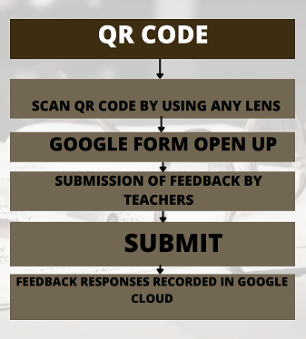

## Problem Statement

To create a feedback system for monitoring washrooms cleanliness of our college which can enable the faculty to rate their experience and submit a service request for poor and bad services.

## Application Features

1. Analysis can be done on daily basis, weekly basis as well as on monthly basis.
2. We can get analysis of single washroom and also comparison analysis of multiple washrooms can also be done.
3. Ratings which are less than 2.5 will be shown in tabular form for every washroom of each block.
4. Tabular data has been provided along with mail in the form of csv file.
5. Analysis has been shown with the help of graphs and textual explanation has also been given with that.

 

